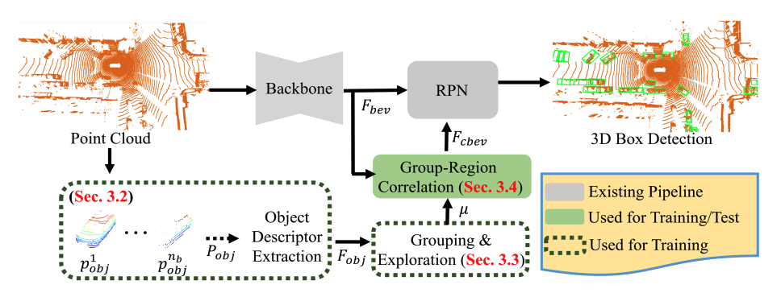

# GroupExp-DA

Code release for the paper **Towards Learning Group-Equivariant Features for Domain Adaptive 3D Detection**, NeurIPS 2024



**Authors**: Sangyun Shin, Yuhang He,  Madhu Vankadari, Ta-Ying Cheng, Qian Xie, Andrew Markham, Niki Trigoni 

[[paper]](https://openreview.net/pdf?id=YEtirXhsh1);


## Introduction

Our code is heavily based on [ST3D](https://github.com/CVMI-Lab/ST3D/tree/st3d_v0.2) with the modification for the adaptability to recent PyTorch versions. 

## Installation

Please refer to [INSTALL.md](docs/INSTALL.md) for the installation.

## Getting Started

Please refer to [GETTING_STARTED.md](docs/GETTING_STARTED.md) to learn more usage about this project.

### Supported features and ToDo List

- [ ] Update to Latest OpenPCDet version.
  
- [ ] Support more adaptation tasks.

## License

Our code is released under the Apache 2.0 license.

## Citation

If you find this project useful in your research, please consider cite:
```
@inproceedings{shintowards,
  title={Towards Learning Group-Equivariant Features for Domain Adaptive 3D Detection},
  author={Shin, Sangyun and He, Yuhang and Vankadari, Madhu and Cheng, Ta-Ying and Xie, Qian and Markham, Andrew and Trigoni, Niki},
  booktitle={The Thirty-eighth Annual Conference on Neural Information Processing Systems}
}
```
